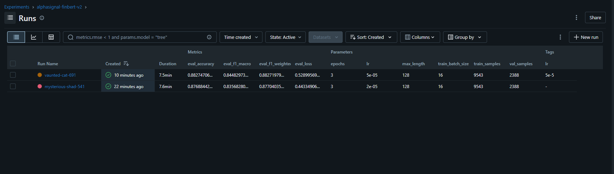

# AlphaSignal

A local financial news sentiment analysis and market intelligence agent. Fine-tunes FinBERT on Financial PhraseBank, tracks experiments with MLflow, and exposes a LangGraph agent that reasons over live market data using Ollama's llama3.2.

---

## Architecture

```
┌─────────────────────────────────────────────────────────────────┐
│  React + Vite + Tailwind v4 (port 5173)                        │
│  ┌─────────────────┐  ┌────────────────────────────────────┐   │
│  │ Sentiment Card  │  │       Agent Query Card             │   │
│  └────────┬────────┘  └──────────────┬─────────────────────┘   │
└───────────┼──────────────────────────┼─────────────────────────┘
            │ POST /sentiment           │ POST /agent/query
┌───────────▼──────────────────────────▼─────────────────────────┐
│  FastAPI backend (port 8000)                                    │
│  ┌──────────────┐  ┌─────────────────────────────────────────┐ │
│  │ sentiment.py │  │ agent.py (LangGraph ReAct)              │ │
│  │ FinBERT      │  │  ├─ get_sentiment  → sentiment.py       │ │
│  │ checkpoint   │  │  ├─ search_news    → rag.py (ChromaDB)  │ │
│  └──────┬───────┘  │  └─ summarize_signals → news.py        │ │
│         │          │            ↓                            │ │
│  ┌──────▼───────┐  │  Ollama llama3.2 (local, port 11434)   │ │
│  │  cache.py    │  └─────────────────────────────────────────┘ │
│  │  Redis TTL   │                                               │
│  └──────────────┘  ┌──────────┐  ┌──────────────────────────┐ │
│                    │ news.py  │  │ rag.py                   │ │
│                    │ yfinance │  │ LlamaIndex + ChromaDB    │ │
│                    └──────────┘  │ all-MiniLM-L6-v2 embeds  │ │
│                                  └──────────────────────────┘ │
└─────────────────────────────────────────────────────────────────┘

┌─────────────────────────────────────────────────────────────────┐
│  finetune/                                                      │
│  ├─ train.py    → HuggingFace Trainer + MLflow logging         │
│  └─ evaluate.py → confusion matrix + classification report     │
│  Dataset: Financial PhraseBank (sentences_allagree)            │
│  Base model: ProsusAI/finbert → saved to finetune/checkpoints/ │
└─────────────────────────────────────────────────────────────────┘
```

---

## Stack

| Layer | Technology |
|---|---|
| Sentiment model | Fine-tuned FinBERT (ProsusAI/finbert) |
| Experiment tracking | MLflow |
| Agent orchestration | LangGraph (ReAct) |
| LLM reasoning | Ollama llama3.2 (local) |
| Document pipeline / RAG | LlamaIndex |
| Vector store | ChromaDB |
| Embeddings | sentence-transformers/all-MiniLM-L6-v2 |
| Cache | Redis (1-hour TTL per ticker) |
| Market data | yfinance |
| Backend | FastAPI + Uvicorn |
| Frontend | React + Vite + Tailwind CSS v4 |
| CI/CD | GitHub Actions (pytest + flake8) |

---

## How to Run Locally

### Prerequisites

- Python 3.11+
- Node.js 18+
- [Ollama](https://ollama.com/) installed
- Redis running on `localhost:6379`

### 1. Pull the LLM

```bash
ollama pull llama3.2
```

### 2. Start required services

```bash
# Terminal 1 — Redis
redis-server

# Terminal 2 — MLflow UI (optional, view at http://localhost:5000)
mlflow ui
```

### 3. Install Python dependencies

```bash
cd alphasignal
pip install -r requirements.txt
```

### 4. Fine-tune FinBERT (optional — skipped if checkpoint already exists)

```bash
# Downloads Financial PhraseBank and trains for 3 epochs (~10 min on CPU)
python -m finetune.train

# Evaluate and log confusion matrix + classification report
python -m finetune.evaluate
```

If you skip fine-tuning, the backend falls back to the base `ProsusAI/finbert` checkpoint automatically.

### 5. Start the backend

```bash
uvicorn backend.main:app --reload --host 0.0.0.0 --port 8000
```

### 6. Start the frontend

```bash
cd frontend
npm install
npm run dev
# Open http://localhost:5173
```

---

## API Endpoints

### `POST /sentiment`

```json
// Request
{ "ticker": "NVDA" }

// Response
{
  "ticker": "NVDA",
  "overall_sentiment": "positive",
  "confidence": 0.874,
  "label_distribution": { "positive": 12, "negative": 3, "neutral": 5 },
  "headlines_analyzed": 20,
  "cached": false
}
```

### `POST /agent/query`

```json
// Request
{ "question": "Is NVDA bullish this week and why?" }

// Response
{
  "question": "Is NVDA bullish this week and why?",
  "answer": "Based on 20 recent headlines, NVDA shows a BULLISH signal ..."
}
```

---

## Example Agent Queries

```
"Is NVDA bullish this week and why?"
"What is the current sentiment for TSLA?"
"Compare AAPL and MSFT market signals."
"What are analysts saying about AMD's AI chip strategy?"
"Summarize the sentiment trend for AMZN over the past week."
```

---

## Running Tests

```bash
pytest tests/ -v
```

---

## MLflow Experiments

<!-- Screenshot placeholder -->
> After running `finetune/train.py`, open `http://localhost:5000` to view:
> - F1 macro / F1 weighted / accuracy per epoch
> - Training loss curve
> - Confusion matrix artifact
> - Best checkpoint artifact



---

## Project Structure

```
alphasignal/
├── finetune/
│   ├── train.py           # FinBERT fine-tuning + MLflow logging
│   └── evaluate.py        # Evaluation, confusion matrix, MLflow artifacts
├── backend/
│   ├── main.py            # FastAPI app — /sentiment and /agent/query
│   ├── agent.py           # LangGraph ReAct agent + 3 tools
│   ├── sentiment.py       # FinBERT inference singleton
│   ├── news.py            # yfinance headline fetcher
│   ├── rag.py             # LlamaIndex + ChromaDB pipeline
│   └── cache.py           # Redis get/set with 1-hour TTL
├── frontend/
│   └── src/App.jsx        # React UI (ticker input + agent query)
├── tests/
│   └── test_api.py        # pytest tests for both endpoints
├── .github/
│   └── workflows/ci.yml   # GitHub Actions — pytest + flake8
├── requirements.txt
├── pytest.ini
├── setup.cfg
└── README.md
```

---

## Environment Variables

| Variable | Default | Description |
|---|---|---|
| `FINBERT_CHECKPOINT` | `finetune/checkpoints/best` | Path to fine-tuned model |
| `REDIS_HOST` | `localhost` | Redis host |
| `REDIS_PORT` | `6379` | Redis port |
