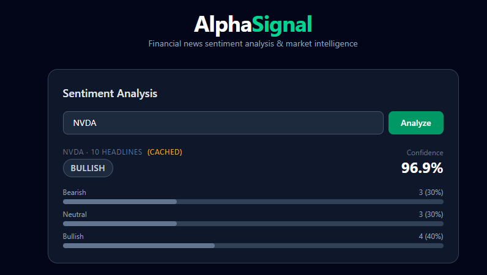
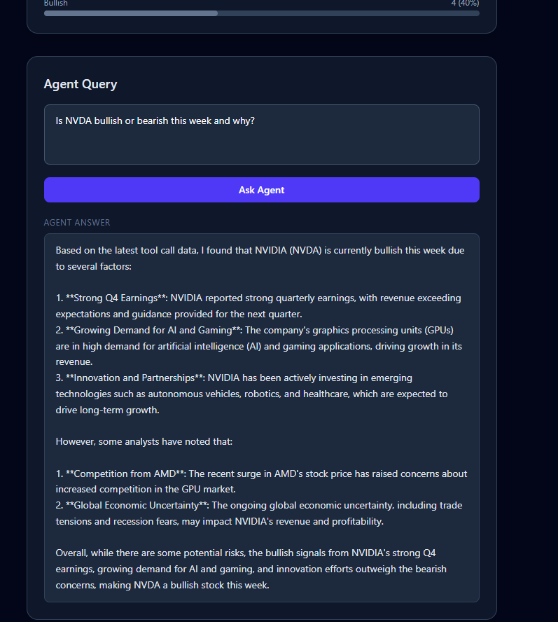

# AlphaSignal

> Financial news sentiment analysis and market intelligence agent — fine-tuned FinBERT + LangGraph reasoning over live market data.

---

## Tech Stack

| Layer | Technology |
|---|---|
| Sentiment model | FinBERT fine-tuned on Twitter Financial News Sentiment (HuggingFace Trainer) |
| Experiment tracking | MLflow — per-run metrics, confusion matrix, checkpoint artifacts |
| Agent orchestration | LangGraph ReAct agent with 3 tools |
| LLM reasoning | Ollama llama3.2 — fully local, no API key |
| Document pipeline | LlamaIndex — chunking, indexing, retrieval |
| Vector store | ChromaDB — persistent semantic search |
| Embeddings | sentence-transformers/all-MiniLM-L6-v2 |
| Cache | Redis via Upstash — 1-hour TTL per ticker |
| Training data | Twitter Financial News Sentiment dataset (HuggingFace) |
| Live news | yfinance — real-time ticker headlines, free, no API key |
| Backend | FastAPI + Uvicorn |
| Frontend | React + Vite + Tailwind CSS v4 |
| CI/CD | GitHub Actions — pytest + flake8 on every push |

---

## Architecture

Two-stage pipeline: a fine-tuned classifier handles sentence-level sentiment, and a LangGraph agent handles multi-step market reasoning over live news.

```
┌─────────────────────────────────────────────────────────────┐
│  Stage 1 — Sentiment Classification                         │
│                                                             │
│  Twitter Financial News dataset                             │
│       → HuggingFace Trainer (3 epochs)                     │
│       → Fine-tuned FinBERT checkpoint                       │
│       → Labels: bearish / neutral / bullish                 │
│       → MLflow: accuracy, F1, confusion matrix logged       │
└─────────────────────────────────────────────────────────────┘
                          ↓
┌─────────────────────────────────────────────────────────────┐
│  Stage 2 — LangGraph ReAct Agent                            │
│                                                             │
│  User question (natural language)                           │
│       → Ollama llama3.2 reasons over 3 tools:               │
│         ├─ get_sentiment(ticker, date_range)                 │
│         │    yfinance headlines → FinBERT inference         │
│         │    → Redis cache (TTL 1h)                         │
│         ├─ search_news(ticker, topic)                        │
│         │    LlamaIndex → ChromaDB semantic search          │
│         │    all-MiniLM-L6-v2 embeddings                    │
│         └─ summarize_signals(ticker)                         │
│              bullish/bearish % trend + directional signal   │
│       → FastAPI /agent/query → React frontend               │
└─────────────────────────────────────────────────────────────┘
```

---

## MLflow Experiments

Two training runs compared with different learning rates:


| Run | Learning Rate | Accuracy | F1 Macro | F1 Weighted |
|---|---|---|---|---|
| Run 1 (mysterious-shad-541) | 2e-05 | 87.7% | 83.6% | 87.7% |
| Run 2 (vaunted-cat-691) | **5e-05** | **88.3%** | **84.5%** | **88.3%** |

Best checkpoint saved automatically via `load_best_model_at_end=True` and logged as an MLflow artifact. Confusion matrix and classification report also logged per run.

---

## Demo

### Sentiment Analysis


### Agent Query


---

## Key Results

| Metric | Value |
|---|---|
| Best accuracy | 88.3% |
| F1 Macro | 84.5% |
| Redis cache hit | Sub-100ms response on repeated ticker queries |
| Agent latency | ~3–6s (Ollama local inference, no network) |

---

## How to Run Locally

### Prerequisites

- Python 3.11+
- Node.js 18+
- [Ollama](https://ollama.com/) installed

### 1. Pull the LLM

```bash
ollama pull llama3.2
```

### 2. Clone and install

```bash
git clone <your-repo-url>
cd alphasignal
pip install -r requirements.txt
```

### 3. Configure environment

Create a `.env` file in the project root:

```bash
REDIS_URL=rediss://<your-upstash-endpoint>:6379
```

### 4. Fine-tune FinBERT

```bash
# Train — logs to MLflow, saves best checkpoint
python -m finetune.train

# Evaluate — logs confusion matrix + classification report
python -m finetune.evaluate
```

If you skip fine-tuning, the backend falls back to base `ProsusAI/finbert` automatically.

### 5. Start all services

```bash
# Terminal 1 — MLflow UI (http://localhost:5000)
mlflow ui --backend-store-uri sqlite:///mlflow.db

# Terminal 2 — FastAPI backend
uvicorn backend.main:app --host 127.0.0.1 --port 8000 --reload

# Terminal 3 — React frontend (http://localhost:5173)
cd frontend && npm install && npm run dev
```

---

## Example Agent Queries

```
"Is NVDA bullish this week and why?"
"What are analysts saying about AMD's AI chip strategy?"
"Summarize the sentiment trend for TSLA over the past week."
```

---

## API Reference

**`POST /sentiment`** — returns cached or fresh FinBERT sentiment for a ticker

```json
{ "ticker": "NVDA" }
→ { "overall_sentiment": "bullish", "confidence": 0.883, "label_distribution": {...}, "cached": false }
```

**`POST /agent/query`** — runs the LangGraph agent on a natural language question

```json
{ "question": "Is NVDA bullish this week and why?" }
→ { "answer": "Based on 18 recent headlines, NVDA shows a BULLISH signal (72% positive)..." }
```

---

## Project Structure

```
alphasignal/
├── finetune/
│   ├── train.py        # FinBERT fine-tuning + MLflow tracking
│   └── evaluate.py     # Confusion matrix + classification report
├── backend/
│   ├── main.py         # FastAPI — /sentiment and /agent/query
│   ├── agent.py        # LangGraph ReAct agent + 3 tools
│   ├── sentiment.py    # FinBERT inference singleton
│   ├── news.py         # yfinance headline fetcher
│   ├── rag.py          # LlamaIndex + ChromaDB pipeline
│   └── cache.py        # Upstash Redis — 1h TTL per ticker
├── frontend/
│   └── src/App.jsx     # React UI
├── tests/
│   └── test_api.py     # pytest — both endpoints mocked
├── .github/
│   └── workflows/ci.yml
└── requirements.txt
```

---

## CI/CD

GitHub Actions runs on every push — installs dependencies, runs `pytest`, and lints with `flake8`. Badge reflects latest main branch status.
